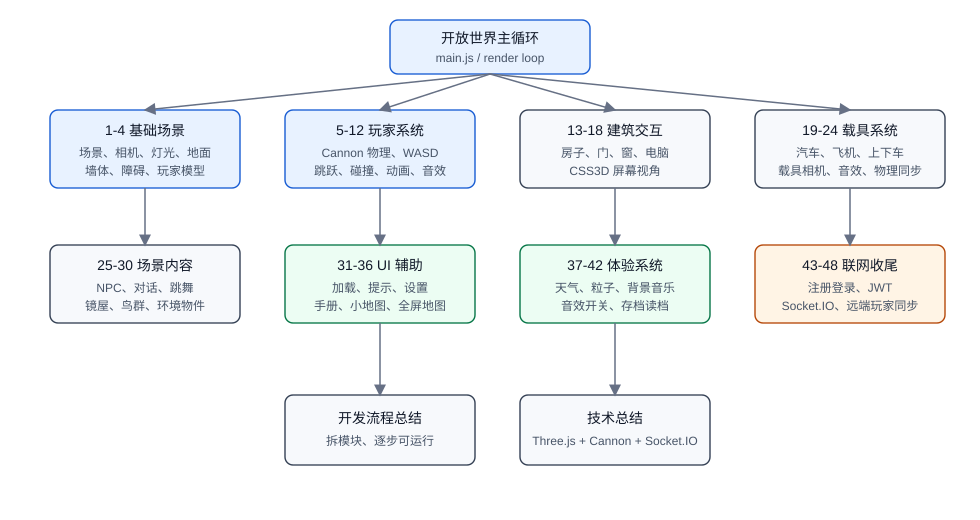

# Three.js 开放世界 48 章总结与 AI 复现提示词

## 依据与边界

本总结基于以下信息整理：

- 浏览器中打开的掘金小册《Three.js 通关秘籍》目录，确认“综合实战：开放世界”共 48 篇，并有“开发流程总结”“技术总结”2 篇。
- 当前可见章节正文片段，内容涉及开放世界基础场景、玩家、立方体、墙壁、模型加载等。
- 公开代码仓库最终项目结构，目标项目是 Vite + Three.js + cannon-es + socket.io-client 的开放世界项目。

注意：公开接口只能拿到章节元数据，不能批量读取付费正文。因此下面的“章节归类”不是逐篇正文摘要，而是结合目录顺序、当前正文片段和最终代码模块反推出的工程阶段划分。

## 目标项目概览

最终项目是一个浏览器端 3D 开放世界小项目，核心技术栈和模块如下：

- 前端构建：Vite
- 3D 渲染：Three.js
- 物理：cannon-es
- 模型资源：GLB 模型，如 `Soldier.glb`、`car.glb`、`toy_plane.glb`、`person.glb`、`birds.glb`
- 音频资源：走路、开车、开飞机、背景音乐
- UI：HTML/CSS 面板、小地图、设置面板、手册、登录注册弹窗
- 联网：Socket.IO 客户端，连接 `/world` 命名空间同步远端玩家
- 本地状态：localStorage 存档读档

最终代码模块大致包括：

- `main.js`：主场景、渲染循环、键盘事件、UI 面板、模式切换
- `mesh.js`：玩家、地面、墙、障碍物、Cannon 物理世界、玩家移动
- `car.js`：车辆模型、车辆物理、驾驶控制、车辆音效
- `plane.js`：飞机模型、飞行控制、高度控制、飞机音效
- `house.js`：房子、墙、窗、门、铰链约束、电脑摆放
- `computer.js`：CSS3D 屏幕、电脑模式、相机切换
- `person.js`：NPC 模型与碰撞体
- `dancingMirrorHut.js`：镜屋、跳舞角色、反射镜
- `birds.js`：鸟群加载与飞行动画
- `map.js`：小地图、全屏地图、玩家/载具/NPC 标记
- `weather.js`：晴天、雨天、雪天、雾天、粒子和光照变化
- `save.js`：本地存档、读档、版本字段
- `api/register.js`、`api/login.js`：账号注册和登录请求
- `worldSync.js`、`remotePlayers.js`：Socket.IO 连接和远端玩家同步

## 48 章分类总结

| 范围 | 主题 | 主要在做什么 | 对应模块 |
| --- | --- | --- | --- |
| 1-4 | 基础场景 | 创建 Vite + Three.js 项目，搭建 Scene/Camera/Renderer，添加灯光、地面、墙、障碍物，加载玩家模型 | `main.js`、`mesh.js` |
| 5-12 | 玩家控制与物理 | 引入 Cannon 物理世界，给地面、墙、障碍物和玩家加刚体，实现 WASD、跳跃、碰撞、楼梯、指针锁定、行走动画和走路音效 | `mesh.js` |
| 13-18 | 建筑与交互点 | 创建房子、墙体、窗户、屋顶、可旋转门，加入电脑模型，用 CSS3DRenderer 实现电脑屏幕交互和相机切换 | `house.js`、`computer.js` |
| 19-24 | 载具系统 | 加入汽车和飞机模型，建立载具刚体，实现靠近提示、上下车、上下飞机、载具相机、驾驶控制、飞行高度控制和载具音效 | `car.js`、`plane.js`、`main.js` |
| 25-30 | NPC 与场景内容 | 加入 NPC、对话系统、跳舞角色、镜屋、鸟群、环境装饰，让世界从“可走场景”变成“有内容的场景” | `person.js`、`dancingMirrorHut.js`、`birds.js` |
| 31-36 | UI 与辅助系统 | 加入加载进度、操作提示、设置面板、使用手册、小地图、全屏地图、地图标记和方向箭头 | `loading.js`、`map.js`、`style.css`、`index.html` |
| 37-42 | 天气、音频、存档 | 实现晴雨雪雾天气、雨雪粒子、雾效、光照变化、背景音乐、音效开关、localStorage 存档读档 | `weather.js`、`save.js`、`main.js` |
| 43-48 | 登录与多人同步 | 加入注册、登录、JWT 持久化、Socket.IO 连接、远端玩家列表、远端玩家模型克隆、位置/朝向/动画同步 | `api/*`、`worldSync.js`、`remotePlayers.js` |
| 总结 2 篇 | 方法论 | 开发流程总结讲如何把复杂 3D 项目拆成一系列可运行小步骤；技术总结讲项目使用到的 Three.js、Cannon、CSS2D/CSS3D、Socket.IO、存档等关键技术 | 总体复盘 |

## 框架图

SVG 源文件保存在同目录：



## AI 复现代码的原则

不要让 AI 一次性生成整个 48 篇对应的完整项目。这个项目模块多、状态多、资源多、交互多，一次生成很容易出现这些问题：

- 文件过大，`main.js` 变成不可维护的大文件。
- 模型加载、物理刚体、动画 mixer、相机切换互相冲突。
- 代码看似完整，但运行时缺少资源、事件、导出函数或状态同步。
- 多人同步和登录注册没有与前端状态对齐。

更稳的方式是分阶段生成，每一阶段都要求“可运行、可验收、可继续扩展”。

## 通用提示词模板

```text
你是资深前端 3D 工程师。请用 JavaScript + Vite + Three.js + cannon-es 实现一个开放世界项目。

约束：
1. 使用 ESM 模块拆分，不要把全部代码写进 main.js。
2. 每一步都必须可运行，先给文件结构，再给完整代码。
3. 目标模块包括：基础场景、玩家物理移动、房子和电脑、汽车、飞机、NPC 对话、天气、小地图、存档、登录注册、Socket.IO 多人同步。
4. 资源放在 public：Soldier.glb、car.glb、toy_plane.glb、person.glb、birds.glb、walk.mp3、开车.mp3、开飞机.mp3、秋日私语.mp3。
5. 输出时说明每个文件职责、运行命令、验收方式。
6. 不要省略关键实现，不要只给伪代码。

当前阶段：{填阶段名}
请只实现这个阶段，并保证不破坏前面阶段。
```

## 分阶段提示词

### 阶段 1：基础 Three.js 开放世界

```text
阶段 1：生成基础 Three.js 开放世界。

请创建一个 Vite + Three.js 项目，实现：
1. scene、camera、WebGLRenderer。
2. 环境光和方向光，方向光开启阴影。
3. 100x100 地面。
4. 四面墙作为世界边界。
5. 若干可以跳上的障碍物或平台。
6. 加载 public/Soldier.glb 作为玩家模型。
7. 使用模块化结构：main.js 负责启动，mesh.js 负责基础世界和玩家模型。

验收标准：
- npm run dev 后能看到 3D 场景。
- 能看到地面、墙、障碍物、玩家模型。
- 控制台没有模块导入错误。
```

### 阶段 2：玩家控制和物理

```text
阶段 2：加入玩家控制和物理。

在上一阶段基础上加入 cannon-es：
1. 创建 Cannon world。
2. 给地面、墙、障碍物创建静态刚体。
3. 给玩家创建圆柱或胶囊近似刚体。
4. 实现 WASD 移动、空格跳跃。
5. 实现鼠标控制视角，点击画布进入 pointer lock。
6. 相机跟随玩家。
7. 根据移动状态切换 idle/walk 动画。
8. 移动时播放 walk.mp3，停止时暂停。

验收标准：
- 玩家不能穿墙。
- 玩家可以跳上平台或楼梯。
- 走路时播放走路动画和音效。
- 鼠标锁定和退出逻辑正常。
```

### 阶段 3：建筑、电脑与交互点

```text
阶段 3：加入房子、门和电脑交互。

请继续拆分模块：
1. house.js：创建房子、墙体、窗户、屋顶、可旋转门。
2. 门使用 cannon-es 的铰链约束或等价方式实现可开关。
3. computer.js：加载 desk.glb 和 monitor.glb。
4. 使用 CSS3DRenderer 在显示器位置显示一个 iframe 或桌面 UI。
5. 玩家靠近电脑后按 E 进入电脑模式，再按 E 退出。
6. 进入电脑模式时相机切换到屏幕前方，退出时恢复到玩家视角。

验收标准：
- 房子和电脑出现在开放世界中。
- 玩家靠近电脑时出现操作提示。
- E 键可以进入和退出电脑模式。
```

### 阶段 4：汽车和飞机

```text
阶段 4：加入汽车和飞机载具。

请新增：
1. car.js：加载 car.glb，创建车辆刚体，支持 W/S 前进后退、A/D 转向。
2. plane.js：加载 toy_plane.glb，创建飞机刚体，支持 W/S 前进后退、A/D 转向、空格上升、Shift 下降。
3. 玩家靠近汽车按 X 上车/下车。
4. 玩家靠近飞机按 C 上飞机/下飞机。
5. 上载具后隐藏玩家模型，把相机挂到载具上。
6. 下载具后恢复玩家模型、玩家物理体和玩家相机。
7. 加入开车.mp3、开飞机.mp3 音效。

验收标准：
- 只有靠近载具才能上车或上飞机。
- 上车/上飞机后控制对象切换到载具。
- 下车/下飞机后玩家回到载具旁边。
- 飞机在空中时不能直接下飞机，必须接近地面。
```

### 阶段 5：NPC、对话、镜屋和鸟群

```text
阶段 5：加入 NPC 和场景内容。

请新增：
1. person.js：加载 person.glb，创建 NPC 刚体和名称标签。
2. main.js 中加入靠近 NPC 按 H 对话、按 K 结束。
3. dancingMirrorHut.js：创建镜屋，使用 Reflector 实现镜面效果，加入跳舞角色。
4. 玩家与跳舞角色完成对话后，按 J 播放玩家跳舞动画，按 L 结束。
5. birds.js：加载 birds.glb，让鸟群在世界边界内随机飞行。

验收标准：
- NPC 有碰撞体，不会被玩家穿过。
- 对话框在靠近 NPC 时正常显示。
- 镜屋可见，镜面不会明显闪烁。
- 鸟群有循环飞行动画。
```

### 阶段 6：UI、小地图和设置

```text
阶段 6：加入 UI、设置面板、使用手册和地图。

请实现：
1. 加载遮罩和加载进度条。
2. 屏幕中央操作提示 viewTip。
3. 设置面板：背景音乐开关、音效开关、小地图开关、天气按钮、存档读档按钮。
4. 使用手册面板。
5. map.js：用 canvas 绘制小地图和全屏地图。
6. 地图标记包括玩家、汽车、飞机、NPC、房子、镜屋。
7. M 键切换全屏地图，? 键切换手册，P 键切换设置。

验收标准：
- 小地图能实时更新玩家和载具位置。
- 全屏地图能显示图例和方向箭头。
- 设置面板不会触发 pointer lock。
```

### 阶段 7：天气、音频和存档

```text
阶段 7：加入天气、音频和存档系统。

请实现：
1. weather.js：晴天、雨天、雪天、雾天。
2. 雨雪使用粒子系统，雾天使用 scene.fog，天气会影响天空颜色和光照。
3. 数字键 1/2/3/4 切换天气。
4. 背景音乐使用秋日私语.mp3，首次用户交互后播放。
5. save.js：将玩家、汽车、飞机、门、天气、设置写入 localStorage。
6. 读档前强制退出汽车、飞机和电脑模式。

验收标准：
- 天气切换有视觉变化。
- 存档后刷新页面仍可读档恢复位置和设置。
- 在载具或电脑模式下不能直接存档。
```

### 阶段 8：登录注册和多人同步

```text
阶段 8：加入账号和多人同步。

请实现前端和必要后端约定：
1. 前端 api/register.js：POST /api/user/register。
2. 前端 api/login.js：POST /api/user/login，成功后保存 accessToken 和 user 到 localStorage。
3. worldSync.js：使用 socket.io-client 连接 /world 命名空间，path 为 /socket.io，auth 里传 token。
4. 在玩家步行状态下以 12Hz 左右上传 position 和 rotationY。
5. remotePlayers.js：加载一次 Soldier.glb 作为模板，用 SkeletonUtils.clone 克隆远端玩家。
6. 接收 worldRoster、playerJoined、playerLeft、playerState。
7. 根据远端玩家移动距离切换 idle/walk 动画。
8. 不渲染当前登录用户自己的远端副本。

验收标准：
- 两个浏览器用不同账号登录后，能互相看到玩家。
- 远端玩家位置、朝向和走路动画能同步。
- 断线或退出后远端玩家会被移除并释放资源。
```

## 推荐复现顺序

1. 先实现阶段 1-2，确认基础世界和玩家移动稳定。
2. 再实现阶段 3-5，丰富可交互内容。
3. 接着实现阶段 6-7，提高可用性和沉浸感。
4. 最后实现阶段 8，因为联网功能依赖前面已有的玩家状态、模型克隆和主循环。

每次让 AI 输出代码后，都应该要求它补充：

- 新增或修改了哪些文件。
- 每个文件负责什么。
- 如何运行。
- 如何手动验收。
- 可能的运行错误和排查方式。

